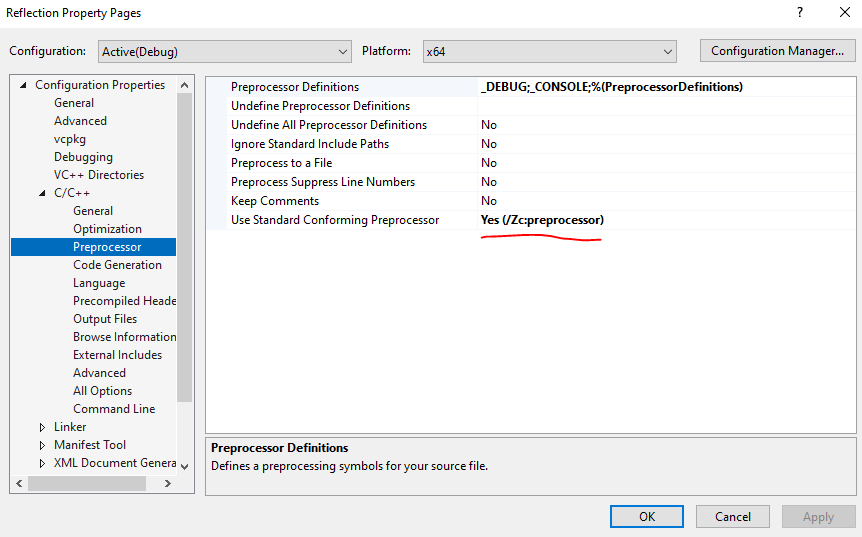

# C++20 Simple Static Reflection
A extremely trivial static reflection library, it allows you to iterate through a class's data member regardless of type. This allows you to automatically do things such as de/serialisation and printing in a scalable manner.

## Installation
A single header only file, you only need to download and include "reflection.hpp" in your C++ project.

## API
The API is extremely straightforward. First, include "reflection.hpp" in whatever file you want to use. Just include the REFLECTABLE macro, providing the data members in your classes and you will be able to iterate through these data members, in order.
```cpp
struct Point {
    float x = 0;
	float y = 0;
	
    REFLECTABLE(x, y) // <-- Simply add this macro and your class is now reflectable
};
```  
You can then print any reflected class.
```cpp
Point const pt {};
reflection::print(pt); // print requires data member to overload the operator<<.
```
What if you want to do something generic with each data member? Simply use `reflection::visit` and provide a unary lambda.
```cpp
reflection::visit([&](auto fieldData) {	
	auto& dataMember = fieldData.get();
	const char* dataMemberName = fieldData.name();

	// From here you can do whatever you want with the data member.
	// from printing, de/serialization, etc..
	std::cout << dataMemberName  << " = " << dataMember << '\n';
}, pt);
```
For each data member, you get it's respective field data. Simply call `.get()` and you will get a reference to the data member (constness is respected). You can also call `.name()` to retrieve the identifier of the data member (constexpr). 

Reflection works recursively. Take this example.
```cpp
struct Points {
	Point pt1 {};
	Point pt2 {};
}

Points pts {};
reflection::print(pts);
```
As data member pt1 and pt2 are also reflectable, it prints their data member as well! You can also use `reflection::prettyPrint(pts)` to visualise this.

Finally, if you need to check if a class is reflectable, you can use `reflection::isReflectable<T>()`.
```cpp
if constexpr (reflection::isReflectable<Point>()) {
	std::cout << "Class is reflectable.\n";
}
else {
	std::cout << "Class is not reflectable.\n";
}
```
Some static asserts have been placed such that for compilation error, there is a nicer error message.
### Examples
I strongly recommend taking a look at main.cpp for examples! That pretty much wraps all the API this library provides. If there is any feature you would like me to implement, feel free to make an issue. You can also make an issue if you require any assistance or encounter bugs.

## Please take note of these limitations!
- A maximum of 32 data members is supported.
- Classes must be defined in a namespace scope. They cannot be defined in a local function.
- For MSVC projects, please configure your project properties to use standard conforming preprocessor!

Go to project properties > C/C++ > Preprocessor > Use Standard Conforming Preprocessor and set it to Yes (/Zc:preprocessor).